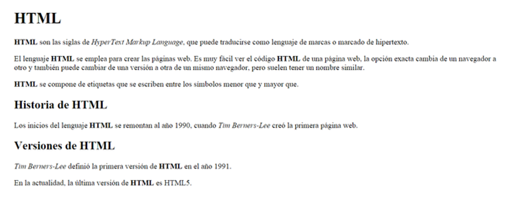
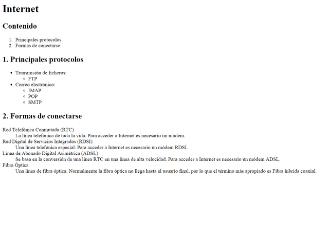
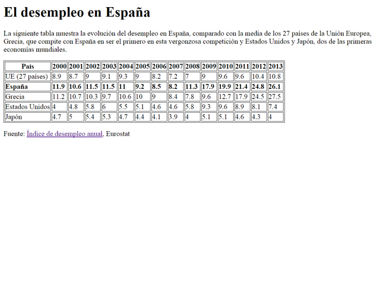

## Clase 01

# Modificaciones en el Ejercicio de HTML



Realiza las siguientes modificaciones:

- Las siglas **HTML** deben aparecer como texto destacado en toda la página.
- **Tim Berners-Lee** debe aparecer como texto enfatizado en toda la página.
- Debes añadir el siguiente contenido:
  - Un encabezado de nivel 1 con el texto "HTML" antes de "HTML son las siglas de...".
  - Un encabezado de nivel 2 con el texto "Historia de HTML" antes de "Los inicios del lenguaje HTML...".
  - Un encabezado de nivel 2 con el texto "Versiones de HTML" antes de dos nuevos párrafos que contienen el texto "Tim Berners-Lee definió la primera versión de HTML en el año 1991" y "En la actualidad, la última versión de HTML es HTML5".

- [Ejercicio_01_1](./01_ejercicios/01_1.html)

# Listas

Usando listas, crea una página, cuyo resultado final sea el siguiente:



- [Ejercicio_01_2](./01_ejercicios/01_2_lista.html)

# Tablas

A partir del siguiente código e información:


```
    <!DOCTYPE html>
    <html>
        <head>
        <title>Desempleo</title>
        <style>
        table, tr, th, td {
        border: 1px solid black;
        }
        </style>
    </head>
        <body>

            El desempleo en España


            La siguiente tabla muestra la evolución del desempleo en España, comparado con la media de los 27 países de la Unión Europea, Grecia, que compite con España en ser el primero en esta vergonzosa competición y Estados Unidos y Japón, dos de las primeras economías mundiales.


            País
            2000
            2001
            2002
            2003
            2004
            2005
            2006
            2007
            2008
            2009
            2010
            2011
            2012
            2013


            UE (27 países)
            8.9
            8.7
            9
            9.1
            9.3
            9
            8.2
            7.2
            7
            9
            9.6
            9.6
            10.4
            10.8


            España
            11.9
            10.6
            11.5
            11.5
            11
            9.2
            8.5
            8.2
            11.3
            17.9
            19.9
            21.4
            24.8
            26.1


            Grecia
            11.2
            10.7
            10.3
            9.7
            10.6
            10
            9
            8.4
            7.8
            9.6
            12.7
            17.9
            24.5
            27.5


            Estados Unidos
            4
            4.8
            5.8
            6
            5.5
            5.1
            4.6
            4.6
            5.8
            9.3
            9.6
            8.9
            8.1
            7.4


            Japón
            4.7
            5
            5.4
            5.3
            4.7
            4.4
            4.1
            3.9
            4
            5.1
            5.1
            4.6
            4.3
            4


            Fuente: Índice de desempleo anual, Eurostat

        </body>
    </html>


```

El resultado final debe ser:



- [Ejercicio_01_3](./01_ejercicios/01_3_tabla.html)