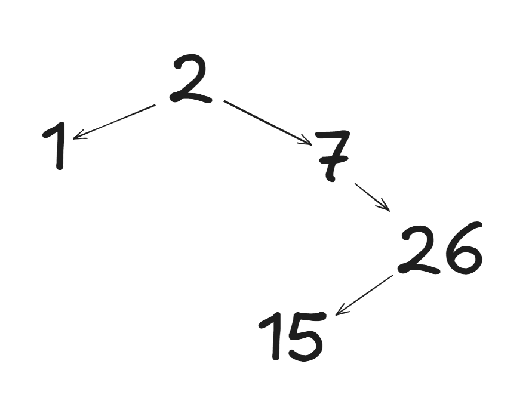

## Clase 10

# Recorridos en Árboles Binarios de Búsqueda (ABB)

## Ejemplo recorridos

- Orden de inserción de los nodos: 15,9,20,8,10,13,12,19,23,21,25

- Preorden: 15,9,8,10,13,12,20,19,23,21,25

- Inorden: 8,9,10,12,13,15,19,20,21,23,25

- Posorden: 8,12,13,10,9,19,21,25,23,20,15

## Ejercicio

- A partir de un ABB con estos nodos: 2,1,7,26,15. Indica qué resultado darían todos los recorridos

**Ejercicio resuelto**

Preorden: 2, 1, 7, 26, 15

Inorden: 1, 2, 7, 15, 26

Posorden: 1, 15, 26, 7, 2



# Manejo de Eventos y Ocultamiento de Contenidos con JavaScript

A partir del siguiente HTML: 

```HTML

    <!DOCTYPE html> <html lang="es"> 
    <head> 
        <meta charset="UTF-8" />
        <title>Ejercicio Eventos</title>
    </head>
    <body>
        <p id="contenidos_1">Lorem ipsum dolor sit amet, consectetuer adipiscing elit. Sed mattis enim
        vitae orci. Phasellus libero. Maecenas nisl arcu, consequat congue, commodo nec, commodo
        ultricies, turpis. Quisque sapien nunc, posuere vitae, rutrum et, luctus at, pede.
        Pellentesque massa ante, ornare id, aliquam vitae, ultrices porttitor, pede. Nullam sit amet
        nisl elementum elit convallis malesuada. Phasellus magna sem, semper quis, faucibus ut,
        rhoncus non, mi. Duis pellentesque, felis eu adipiscing ullamcorper, odio urna consequat arcu,
        at posuere ante quam non dolor. Lorem ipsum dolor sit amet, consectetuer adipiscing elit. Duis
        scelerisque.</p>
        <a id="enlace_1" href="#">Ocultar contenidos</a>
        <br/>
        <p id="contenidos_2">Lorem ipsum dolor sit amet, consectetuer adipiscing elit. Sed mattis enim
        vitae orci. Phasellus libero. Maecenas nisl arcu, consequat congue, commodo nec, commodo
        ultricies, turpis. Quisque sapien nunc, posuere vitae, rutrum et, luctus at, pede.
        Pellentesque massa ante, ornare id, aliquam vitae, ultrices porttitor, pede. Nullam sit amet
        nisl elementum elit convallis malesuada. Phasellus magna sem, semper quis, faucibus ut,
        rhoncus non, mi. Duis pellentesque, felis eu adipiscing ullamcorper, odio urna consequat arcu,
        at posuere ante quam non dolor. Lorem ipsum dolor sit amet, consectetuer adipiscing elit. Duis
        scelerisque.</p>
        <a id="enlace_2" href="#">Ocultar contenidos</a>
        <br/>
        <p id="contenidos_3">Lorem ipsum dolor sit amet, consectetuer adipiscing elit. Sed mattis enim
        vitae orci. Phasellus libero. Maecenas nisl arcu, consequat congue, commodo nec, commodo
        ultricies, turpis. Quisque sapien nunc, posuere vitae, rutrum et, luctus at, pede.
        Pellentesque massa ante, ornare id, aliquam vitae, ultrices porttitor, pede. Nullam sit amet
        nisl elementum elit convallis malesuada. Phasellus magna sem, semper quis, faucibus ut,
        rhoncus non, mi. Duis pellentesque, felis eu adipiscing ullamcorper, odio urna consequat arcu,
        at posuere ante quam non dolor. Lorem ipsum dolor sit amet, consectetuer adipiscing elit. Duis
        scelerisque.</p>
        <a id="enlace_3" href="#">Ocultar contenidos</a>
    </body>
    </html>

```

1. Cuando se pinche sobre el primer enlace, se oculte su sección relacionada

2. Cuando se vuelva a pinchar sobre el mismo enlace, se muestre otra vez esa sección de contenidos

3. Completar el resto de enlaces de la página para que su comportamiento sea idéntico al del primer enlace

4. Cuando una sección se oculte, debe cambiar el mensaje del enlace asociado (pista:propiedad innerHTML)

**Ejercicio resuelto**
- [Ejercicio_10_02](./10_ejercicios/10_02.html)

# Ejercicio Insertar DOM

1. A partir del siguiente código de ejemplo, crea la lista desde JS (usando herramientas de DOM) con un HTML vacío, sólo debe incluir la etiqueta script correspondiente y lo que consideres necesario para que se cree la lista, en ningún caso etiquetas ni contenidos de la lista de definición.

```html

        <dl>
            <dt>Red Telefónica Conmutada (RTC)</dt>
            <dd>La línea telefónica de toda la vida. Para acceder a Internet es necesario un módem.</dd>

            <dt>Red Digital de Servicios Integrados (RDSI)</dt>
            <dd>Una línea telefónica especial. Para acceder a Internet es necesario un módem RDSI.</dd>

            <dt>Línea de Abonado Digital Asimétrica (ADSL)</dt>
            <dd>Se basa en la conversión de una línea RTC en una línea de alta velocidad. Para acceder a Internet es
                necesario un módem ADSL.</dd>

            <dt>Fibra Óptica</dt>
            <dd>Una línea de fibra óptica. Normalmente la fibra óptica no llega hasta el usuario final, por lo que el
                término más apropiado es Fibra híbrida coaxial.</dd>
        </dl>
```

2. Modifica el ejercicio anterior de manera que el usuario pueda insertar definiciones o borrarlas, según decida en la lista y desde JS.

**Ejercicio resuelto**
- [Ejercicio_10_3](./10_ejercicios/10_3.html)

# Creación de tabla dinámica utilizando DOM

**Ejercicio resuelto**
- [Ejercicio_tabla](./10_ejercicios/10_ejercicio_tabla.html)
