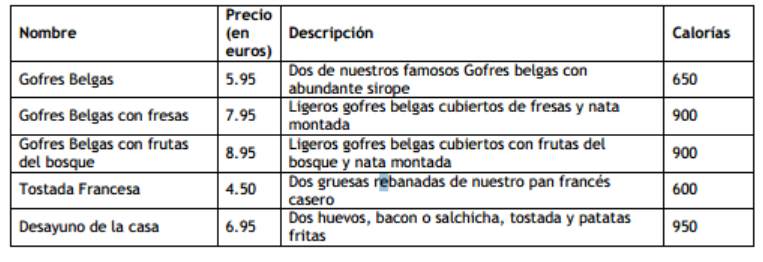

## Clase 12

# Ejercicio Emmet 

Usando el siguiente resumen de [Emmet](https://www.freecodecamp.org/espanol/news/untitled-11/) o la información que encuentres en internet al respecto, haz este HTML con CSS usando Emmet, el resultado al ponerlo en el code debe ser el mismo que si lo hicieras directamente en HTML y CSS, etiqueta a etiqueta y selector a selector.

```html
<!DOCTYPE html>
<html lang="en">

<head>
    <meta charset="UTF-8">
    <meta name="viewport" content="width=device-width, initial-scale=1.0">
    <title>Ejercicio Emmet</title>
</head>

<body>
    <h1>HTML &amp; CSS: Curso práctico avanzado</h1>

    <h2>Datos del libro</h2>

    <ul>
        <li>Título: HTML &amp; CSS: Curso práctico avanzado</li>
        <li>Autor: Sergio Luján Mora</li>
        <li>Editorial: Publicaciones Altaria</li>
        <li>Año de publicación: 2015</li>
        <li>ISBN: 978-84-944049-4-8</li>
    </ul>


    <h2>Descripción del libro</h2>

    <p>
        Aunque los inicios de Internet se remontan a los años sesenta, no ha sido hasta los años noventa cuando, gracias
        a la Web, se ha extendido su uso por todo el mundo. En pocos años, la Web ha evolucionado enormemente: se ha
        pasado de páginas sencillas, con pocas imágenes y contenidos estáticos que eran visitadas por unos pocos
        usuarios a páginas complejas, con contenidos dinámicos que provienen de bases de datos y que son visitadas por
        miles de usuarios al mismo tiempo.
    </p>

    <p>
        Todas las páginas están internamente construidas con la misma tecnología, con el Lenguaje de marcas de
        hipertexto (Hypertext Markup Language, HTML) y con las Hojas de estilo en cascada (Cascading Style Sheets, CSS).
    </p>
</body>

</html>
```

Además, añade los siguientes estilos: 

1. El texto:
- El color del texto es azul: #00F.
- El color de fondo del texto es verde claro: #CFC.
- El tipo de letra: Georgia, Cambria, serif.
- El tamaño del texto: 16px.

2. El encabezado de nivel 1:
- El color del texto es rojo claro: #F00.
- El tipo de letra es la secuencia: Verdana, Calibri, sans-serif.
- El tamaño del texto: 32px.

3. El encabezado de nivel 2:
- El color del texto es rojo claro: #A00.
- El tipo de letra es la secuencia: Verdana, Calibri, sans-serif.
- El tamaño del texto: 24px.

**Ejercicio resuelto**
- [Ejercicio_12_EMMET](./12_ejercicios/12_ejercicio_EMMET/12_ejercicio_EMMET.html)

# JSON

```Javascript 

    [
    {
      "nombre": "Francisco Ramirez",
      "edad": 29,
      "puesto": "Contable",
      "Emails": [
        "francisco@gmail.com",
        "francisco@hotmail.es",
        "francisco@thebridgeschool.es"
      ]
    },
    {
        "nombre": "Isabel Pérez",
        "edad": 31,
        "puesto": "Profesora",
        "Emails": [
          "isabel@gmail.com",
          "isabel@hotmail.es",
          "isabel@thebridgeschool.es"
        ]
      }
  ]

```

En el JSON del último ejemplo indica el código de acceso al email de The Bridge de Isabel.

**Ejercicio resuelto**
- [Ejercicio_12_1_JSON](./12_ejercicios/12_1_JSON.html)

# JSON 2

Partiendo del siguiente JSON

```Javascript 
    {
        "localidade 1": {
        "Continente": "África",
        "País": "Angola",
        "Capital": "Luanda"
        },
        "localidade 2": {
        "Continente": "América do Norte",
        "País": "Estados Unidos",
        "Capital": "Washington DC"
        },
        "localidade 3": {
        "Continente": "América Central",
        "País": "México",
        "Capital": "Cidade do México"
        },
        "localidade 4": {
        "Continente": "América do Sul",
        "País": "Brasil",
        "Capital": "Brasília"
        },
        "localidade 5": {
        "Continente": "Europa",
        "País": "Espanha",
        "Capital": "Madri"
        },
        "localidade 6": {
        "Continente": "Europa",
        "País": "Alemanha",
        "Capital": "Berlim"
        },
        "localidade 7": {
        "Continente": "Oceania",
        "País": "Austrália",
        "Capital": "Camberra"
        },
        "localidade 8": {
        "Continente": "Ásia",
        "País": "Japão",
        "Capital": "Tóquio"
        }
    }

```

Siendo a la variable que almacena el JSON
- Código para obtener el país de la localidade 8
- Código que permite añadir una localidad a tu elección
- Modifica la localidade 4, añadiendo el número de habitantes
- Cambia la estructura del JSON de forma que sea más directo acceder a las capitales de las localidades, dado que va a ser el dato que más vamos a consultar

**Ejercicio resuelto**
- [Ejercicio_12_2_JSON](./12_ejercicios/12_2_JSON.html)

# JSON 3

A partir de la siguiente información, diseña y elabora un JSON que la contenga y permita acceder de manera lo más sencilla posible, a precio y calorías de cada desayuno.



**Ejercicio resuelto**
- [Ejercicio_12_3_JSON](./12_ejercicios/12_3_JSON.html)

# Boolean

Utilizando objetos Boolean realiza un programa que indique si un array de 6 elementos solicitado al usuario se encuentra ordenado de la siguiente forma (e1 > e3, e2 < e4 y e5 = e6).

**Ejercicio resuelto**
- [Ejercicio_12_4_BOOLEAN](./12_ejercicios/12_4_BOOLEAN.html)

# String

Solicita una cadena al usuario e indica la cantidad de veces que aparece la a en las palabras impares.

**Ejercicio resuelto**
- [Ejercicio_12_5_STRING](./12_ejercicios/12_5_STRING.html)


# String 2

Solicita una cadena al usuario y devuélvela invertida
Ej: "Hola, ¿qué tal estás?" -> estás? tal ¿qué Hola,

**Ejercicio resuelto**
- [Ejercicio_12_6_STRING](./12_ejercicios/12_6_STRING.html)

# Array

Crea un array de dos dimensiones (matriz) que contenga números y cadenas solicitados al usuario, muestra por pantalla los elementos cadena que se encuentren en posiciones fila par y columna impar

Ej: 
```
1       Hola      3
Adiós   3         2   -> Muestra Hola y Manzana
4       Manzana   5
 

```

**Ejercicio resuelto**
- [Ejercicio_12_7_ARRAY](./12_ejercicios/12_7_ARRAY.html)

# Array 2

Solicita al usuario un array de máximo 10 números reales y calcula su media.

**Ejercicio resuelto**
- [Ejercicio_12_8_ARRAY](./12_ejercicios/12_8_ARRAY.html)

# Array 3

Crea un array a partir de las siguientes instrucciones: 
- El tamaño es solicitado al usuario
- Elemento1: 1
- Elemento2: 1
- ElementoN: ElementoN-1 + ElementoN-2

**Ejercicio resuelto**
- [Ejercicio_12_9_ARRAY](./12_ejercicios/12_9_ARRAY.html)
